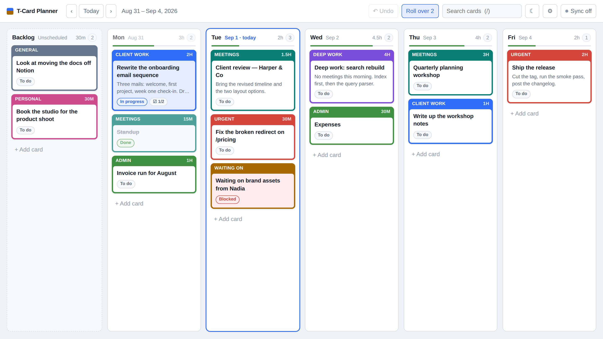
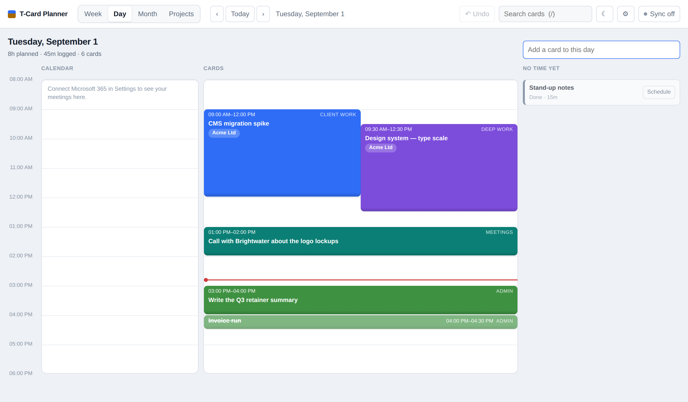
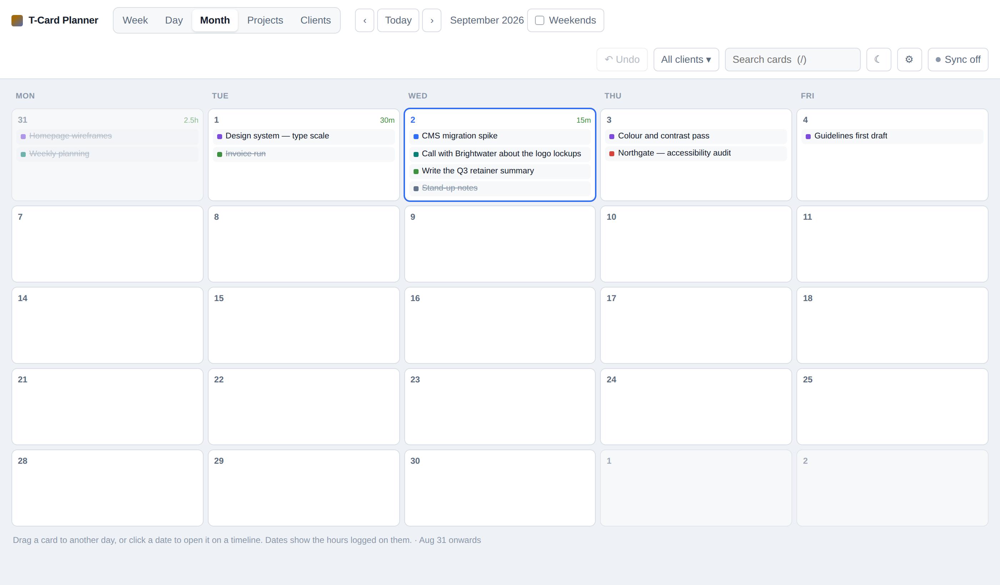
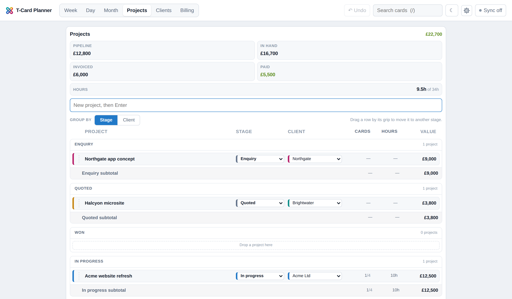
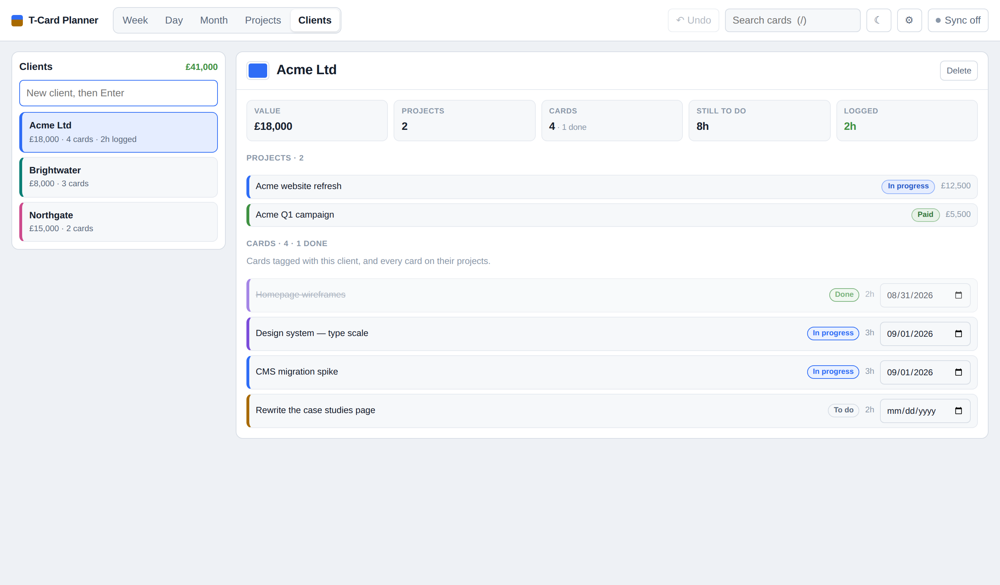
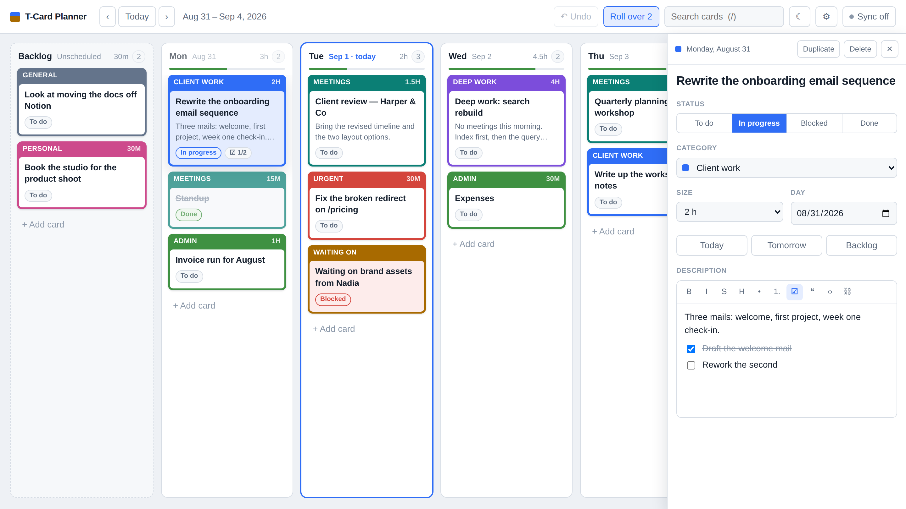
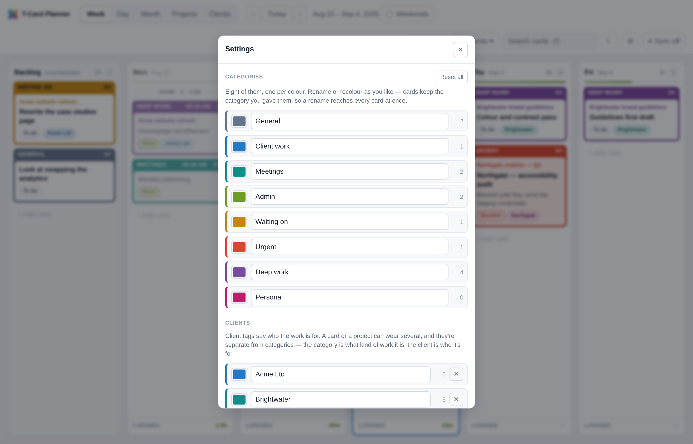
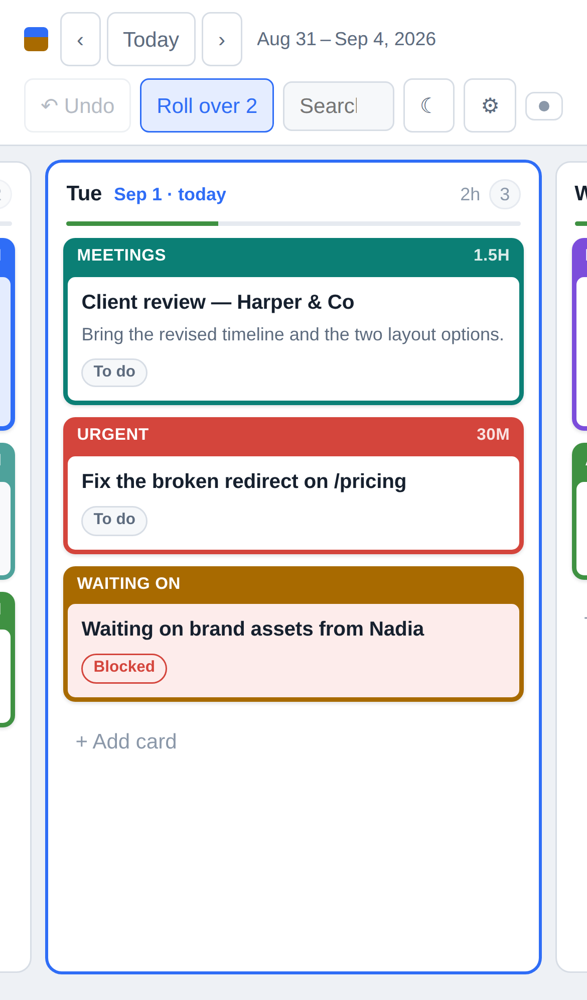

# T-Card Planner

A work planner that sits between a T-card board, a calendar and a kanban board.
Cards carry a title and a rich text description, live in a column per day, and
move by drag and drop. They can belong to a **project** with a value against it,
be tagged with the **clients** they're for, and be published to your **Microsoft
365 calendar**.



## Running it

```bash
npm install
npm run dev          # http://localhost:5173 — board only, no sync
npm run dev:worker   # http://localhost:8787 — board plus the sync API
npm run typecheck    # app and Worker
npm test             # the Access login checks
npm run deploy       # build, then wrangler deploy
```

`npm run dev` is enough for working on the board itself. `dev:worker` runs the
real Worker against a local KV, which is what you want when touching sync; put
a token in `.dev.vars` first:

```
BOARD_TOKEN=any-string-you-like
```

There is no Cloudflare Access in front of a local run — Access lives at the
edge, and `wrangler dev` isn't behind it — so the token is how you get in while
developing. To watch the Worker refuse everything that hasn't logged in, add
`ACCESS_TEAM_DOMAIN` and `ACCESS_AUD` to `.dev.vars` as well: with no real
Access session to present, every request is turned away, which is the point.

## Views

Five of them, along the top: **Week**, **Day**, **Month**, **Projects** and
**Clients**. The first three share one date between them, so switching view
keeps your place — step forward a week, open Day, and you're on a day in that
week rather than back at today.

### Week

One column per weekday, plus a **Backlog** column on the left for anything not
yet given a day. Today's column is outlined and wears a drifting accent rule
along its top edge, and the board opens scrolled to it.

**Weekends** is a tickbox next to the week arrows — Saturday and Sunday are a
property of the week you're looking at, so it sits with the week rather than
behind the gear. It applies to the month too, and follows you between them.

With a calendar connected, each day column carries what's already in it at the
top — time, subject, four at most and a link to the day view past that. Free and
tentative entries are dimmed and italic, since they're on the calendar without
necessarily being a claim on the day. It's context for the plan, not part of it:
nothing there can be dragged or edited.

Each day column ends with the hours **logged** on it — the sized cards that got
finished. The count at the top is what's still ahead of you; the total at the
bottom is what's behind, which is the number you want when looking back at a
week. Click a day's name to open it on a timeline.

### Day



One day, drawn against the clock between the hours you set in Settings.

- **Drag** a card up and down to move it; **drag its bottom edge** to change how
  long it is. Both snap to the quarter hour, and the size you drag out is the
  card's estimate, so it counts toward the day's load like any other.
- Cards that overlap share the width rather than hiding each other.
- Cards with no time sit under **No time yet** on the right. **Schedule** drops
  one onto the timeline after the last thing already on it.
- With a calendar connected, your existing entries sit in their own column
  alongside — there to plan around, not to be edited. All-day entries run across
  the top.
- A line marks now, on today.

### Month



An Outlook-shaped grid of the month — five columns or seven, depending on
whether you've turned the weekend on. Cards are chips you can drag to another
day, calendar entries show as italic chips above them, and each date carries the
hours logged on it. Click a date to open that day's timeline; a cell with more
cards than fit says how many more.

### Projects



A project is a piece of work several cards belong to: a title, a rich text
description, a **value in pounds**, a category, a **stage**, and the client it's
for. One client, not a list — a project belongs to whoever is paying for it.

**The pipeline.** Every project sits at a stage, and the list is ordered by
them, so it reads top to bottom as a funnel with a heading at each step:

| Stage | Counts as |
| --- | --- |
| Enquiry | Pipeline |
| Quoted | Pipeline |
| Won | In hand |
| In progress | In hand |
| Delivered | In hand |
| Invoiced | Invoiced |
| Paid | Paid |
| Closed lost | nothing |

The four totals above the list are those groups added up. They're grouped by
what a stage means for the money rather than by how far along it is — *Won* and
*Delivered* are miles apart in the process and identical in the ledger, both
being work you're committed to and haven't billed for. A lost project is worth
nothing and swells no total. Archived projects are out of the count entirely:
putting one away is saying you've stopped counting it.

- Assign an existing card to a project from the card panel's **Project** box.
- Or add one from inside the project, with the day it lands on set beside the
  box — it inherits the project's category and its client.
- Every card on the project is listed with its day, and the day can be changed
  from there without leaving the view.
- **Archive** takes a finished project out of the card pickers and the totals
  but keeps it. **Delete** removes the project; its cards stay on the board,
  just without one.

Stages are the app's own and fixed, like card statuses — it's the categories and
clients that are yours to name.

### Clients



The same shape as Projects, from the other direction: pick a client and see
what you're doing for them.

- **Value** is their open projects added up, lost ones excluded; **Still to do**
  and **Logged** are the hours on their cards.
- **Their cards** means cards tagged with them *and* every card on their
  projects. That second half matters: a card created inside a project inherits
  its client, but one assigned to the project later doesn't — and either way, a
  card on an Acme project is Acme's work. Counting only the tagged ones would
  quietly under-report what a client is costing you.
- Each of their projects shows the stage it's at, and clicking one opens it.
- Add, rename, recolour and remove clients here as well as in Settings, and
  click one of their projects to jump straight to it.

Removing a client takes the tag off everything wearing it; the cards and
projects themselves stay.

## Narrowing the board

Two ways, and they stack — both have to be satisfied, not either.

**Search** (`/`) matches titles, descriptions, categories, statuses, project
titles and client names.

**The client filter**, next to the search box, narrows the board to one or more
clients using the same definition of their work as the Clients view. It's on the
Week, Day and Month views; Projects and Clients have nothing to narrow.

Both **dim** what doesn't match rather than hiding it, so the shape of the week
stays put while you look at part of it. The filter isn't remembered between
sessions — coming back to a filtered board you don't remember setting is worse
than setting it again.

## The cards

Each card is a T-card: a coloured strip across the top naming its category, and
the body below. Colour is the category (client work, meetings, admin, urgent…),
and it's the thing you read the board by from across the room.

- **Drag** a card to another day, or up and down to reorder within a day.
  Dropping it nowhere puts it back, and `Esc` mid-drag cancels.
- **Click** a card to open it: title, status, category, project, clients, size,
  day, start time, and a rich text description with headings, lists, checklists,
  links and code. It opens in a sidebar or a window, whichever you picked in
  Settings.


- **Status** is the kanban part — To do, In progress, Blocked, Done. Ticking a
  card **Done** sinks it to the bottom of its day, under a divider saying how
  many are down there and how long they took, so the top of a column is what's
  left and the bottom is what you did. Done cards stop counting toward the day's
  load and start counting toward the hours logged on it.
- **Clients** are tags for who the work is for, and a *card* can wear several —
  a project has exactly one. They're separate from the category, which is what
  *kind* of work it is.
- **Category** is a named list rather than a row of swatches, so picking one
  doesn't mean remembering what teal stood for.
- **Size** is a rough hour estimate. Each day's bar fills as you plan it and
  turns red past the hours-per-day you set in Settings, so an over-committed
  Tuesday is visible before you get to it.
- **Start** puts the card at a time of day, which is where the day view draws
  it. Dragging it about on that timeline is usually easier than typing one.
- **Publish to calendar** mirrors the card into Microsoft 365 — see below.

## Settings



Behind the gear.

**Categories.** Eight of them, one per colour, and both halves are yours: the
name on the strip and the colour behind it. Cards store the category rather
than the words, so a rename reaches every card that already carries it —
including the ones in past weeks. Pick a colour and the board works out the
rest of it: the tint the card body takes when a card is in progress, a lifted
version for dark theme, and black or white lettering depending on which one
you can actually read against your colour.

Categories travel with the board, so a rename made on the laptop is there on
the phone after the next sync. Statuses are the app's own and stay put: a
*Blocked* pill is red whatever you do to the red category.

**Clients.** The tags for who work is for: a name and a colour each, and as many
as you bill. Adding one puts it in the picker on every card and project; removing
one takes it off everything that wore it, and says how many that is first. Like
categories they travel with the board rather than with the device. The Clients
view does all of this too, alongside what each client's work adds up to.

**Cards.** Three defaults for how cards behave:

- **Default category** — what a new card starts as, so the one you use most
  isn't a change you make every time.
- **Show descriptions on cards** — the two-line excerpt under the title. Off
  makes a column of cards shorter and the week easier to scan.
- **Open a card in** — a sidebar beside the board, or a window over it.

**The week.** How many hours you count as a full day, the hours the day view's
timeline covers, and the theme. Whether the weekend gets columns is a tickbox on
the board itself.

**Microsoft 365 calendar.** Covered below.

**Backup.** Export writes the whole board — cards, days, categories, projects
and clients — to a JSON file; import replaces what's there, after asking. Both
work on a phone, which is where the old toolbar buttons couldn't go.

## The Microsoft 365 calendar

Two things, deliberately separate: your existing Outlook entries are **read**
into the week, day and month views so the plan is made with your meetings in
front of you, and a card **writes** an entry only when you tick *Publish to
calendar* on it.

The sign-in happens in the browser using the authorization-code flow with
**PKCE**. There is no client secret anywhere, and nothing about it reaches the
Worker — the tokens live on the device that earned them, next to the board. Each
device connects itself.

### Connecting it

If whoever deployed the board set it up with an app registration — see below —
there is nothing to do. Open Settings, press **Connect Microsoft 365**, and
Microsoft asks you to sign in and approve the two permissions the board needs:
reading your profile, and reading and writing your calendar. You land back on
the board connected, and the panel says which account it is.

That is the whole of it for anyone using the board. The rest of this section is
for whoever is deploying it.

### Giving the board an app registration

One registration, made once, and everybody who uses that deployment connects
with a button. Without one, each person has to go and make their own first —
fine for you, a wall for anyone else.

In the [Entra admin centre](https://entra.microsoft.com) (or the Azure portal),
under **App registrations**, add a registration:

1. **Name** it whatever the board is called — the name shows on the consent
   screen people see.
2. **Supported account types.** *Accounts in this organizational directory
   only* if the board is just for your own tenant, which keeps the consent
   screen clean. Choose a multitenant option only if people outside your tenant
   will use it, and read the caveats below before you do.
3. **Redirect URI:** the **Single-page application (SPA)** platform, with the
   board's address and a trailing slash — `https://your.board/`. Add
   `http://localhost:5173/` as a second one for local development; a
   registration can hold several. The SPA platform is what makes PKCE work
   without a secret — the *Web* platform will not do, it insists on one.
4. Under **API permissions**, add Microsoft Graph **delegated** permissions
   `Calendars.ReadWrite` and `User.Read`, then grant consent if your tenant
   requires an admin to.
5. Copy the **Application (client) ID** from the overview page.

Then give it to the build. This is a **build-time** value — Vite substitutes it
into the bundle, so it has to be set where the site is built, not on the Worker:

```
VITE_M365_CLIENT_ID=00000000-0000-0000-0000-000000000000
VITE_M365_TENANT=common          # optional; `common` if unset
```

For a Cloudflare Workers build, those go in the build's environment variables in
the dashboard. Locally, put them in `.env.local` — `.env.example` has both with
their explanations, and `*.local` is already ignored by git.

**The client id is not a secret.** A single-page app is a *public* client: the
id is an identifier, and PKCE — a hash the browser mints per sign-in — is what
proves the thing asking for tokens is the thing that started the login. Nothing
secret is shipped, and none of this reaches the Worker; the tokens live on the
device that earned them.

Anyone who needs a different registration can still supply one per device, under
**Use your own app registration** in the same Settings panel. A client id there
overrides the shipped one, tenant and all; clearing it goes back to the built-in.
With no registration shipped at all, that panel is open by default, because then
it is the only way through.

### What to expect from Microsoft

Two things are worth knowing before you promise anyone a one-click connection:

- **Some tenants don't let users consent to apps.** Where an admin has turned
  user consent off, the first person to connect is told to ask an administrator,
  who approves the app once for everybody. No approach avoids this — it is the
  tenant's policy, not the app's.
- **A multitenant app shows an "unverified" warning** on the consent screen
  until you complete [publisher
  verification](https://learn.microsoft.com/entra/identity-platform/publisher-verification-overview),
  which needs a Microsoft Partner account. A single-tenant registration used
  inside your own tenant doesn't show it.

### What publishing does

Ticking the box on a card creates an entry at its **start time**, running for
its **size** — 9am and an hour if it has neither yet. Editing the card's title,
day, time or length updates the entry; un-ticking the box, or sending the card
back to the backlog, removes it again. A card that's on the calendar wears a ◈
on its strip.

The card is the original and the entry is the copy: edits made in Outlook are
overwritten the next time the card changes. If someone deletes the entry in
Outlook, the next change makes a fresh one rather than giving up.

**Deleting a published card takes its entry with it.** That needs saying because
it isn't automatic: the card carries the id of its entry, so deleting the card
would otherwise take the only pointer to it and leave the entry in Outlook
forever. The id is kept on the board instead, and removed from the calendar by
the next device that has one connected — which is also why it travels with the
board rather than staying on the device that did the deleting. Importing a
backup does the same for everything the old board had published.

Only scheduled cards can be published, because an entry needs a day. The box
says so rather than just greying out.

## Keyboard

| Key | Does |
| --- | --- |
| `N` | New card on today — or on the day you're looking at, in Day view |
| `/` | Focus search |
| `Esc` | Close the card panel or settings, or cancel a drag |
| `⌘Z` / `Ctrl+Z` | Undo the last move or delete |
| `Enter` | Open the focused card |

Search and the client filter both dim what doesn't match rather than hiding it,
so the shape of the week stays put while you look.

## On a big screen

The app stops growing at 2400px and centres what's left. Past that, more pixels
stop being more room and start being a longer sideways glance — six columns
strung across the full width of a 4K panel are further apart than they are
useful. Columns themselves stop at 400px for the same reason: a T-card wider
than that is no longer something you read at a glance.

Below that width nothing changes, so an ordinary laptop is exactly as it was.

## Motion

There is a small amount of it: cards settle in rather than appearing, dialogs
rise, the drawer slides, today's rule drifts, and things lift a little under the
pointer. All of it is decoration, and all of it goes away for anyone whose system
asks for reduced motion — including the drifting rule, which never stops on its
own and is the worst of them for anyone who finds movement difficult.

## On a phone



The board opens on today rather than the far left, and columns snap one at a
time. A swipe scrolls; **press and hold** a card for a moment and it lifts, so
dragging and scrolling don't fight each other. Add it to your home screen and
it runs full-screen, and the app shell is cached so it opens without a signal —
the board itself is already on the device.

## Your data, on more than one device

Cards live in `localStorage` and the app works with no server at all — that is
the **Sync off** state in the toolbar, and it's a perfectly good way to run.

Point it at the Worker and the same board follows you between machines. Behind
Cloudflare Access there is nothing to set up per device: you log in, the badge
reads **Synced** and says which address you logged in as. Each device holds the
whole board and the revision it last agreed with the server:

- Edits are pushed about a second after you stop making them.
- Other devices pick them up when you next look at the tab, and every 45
  seconds while it's open.
- Edits made with no signal queue up and go when you're back — the badge reads
  **Offline** meanwhile.
- When an Access session runs out the badge reads **Signed out** and offers to
  sign you back in. The board keeps working on the device meanwhile; nothing is
  lost, it just stops going up until you're back in.
- If two devices changed the same board while apart, nothing is merged and
  nothing is silently dropped: you are shown both and pick a side. The same
  happens when you first connect a device that already has real work on it.

**Export** still writes a dated JSON backup and **Import** reads one back.
Worth doing occasionally regardless — one KV key is not a backup strategy.

## Deploying it

A single Worker serves both the built app and the API, configured by
`wrangler.jsonc`. Once:

```bash
npx wrangler kv namespace create BOARD      # put the id in wrangler.jsonc
npx wrangler secret put BOARD_TOKEN         # a long random string
```

Then `npm run deploy`, or let a GitHub-connected Worker build run
`npm run build` and deploy with `npx wrangler deploy`.

Until one of `BOARD_TOKEN` or Cloudflare Access is set up the API refuses every
request, so the board is never briefly public while you finish setting it up.
With only a token, open the site, click the sync badge and paste the same token
— once per device. Adding the login below is better, and means you never do
that again.

`wrangler.jsonc` turns the `*.workers.dev` and preview URLs off, so the custom
domain is the only way in — otherwise the same board answers on a second
address that no Access policy on the domain covers. Attach the domain itself in
the dashboard rather than in config: a domain declared in `wrangler.jsonc` makes
a CI deploy ask for a confirmation it cannot get, and fail.

Worth knowing: KV is eventually consistent, so a write can take a few seconds
to reach another region, in which case the other device sees the older board
until it next polls, or is offered the conflict choice.

## The login

A shared token is fine as far as it goes, but it is one secret pasted into
every browser you own, it never expires, and it guards the API while leaving
the app itself open to anyone who finds the address. **Cloudflare Access** puts
a real login in front of the whole thing: you sign in with a code emailed to
you, or with Google or GitHub, and everyone else gets a locked door instead of
a board.

Access does the challenge at the edge, before a request reaches the Worker. The
Worker then verifies the signed token Access attaches (`worker/access.ts`), so
"Access is probably in front of me" becomes something it actually knows — a
request that arrived by some other route is refused rather than trusted.

### Setting it up

In the [Zero Trust dashboard](https://one.dash.cloudflare.com), under **Access
→ Applications**, add a **self-hosted** application:

1. Point it at the board's domain — the whole thing, path included if you like.
2. Give it a policy: **Allow**, *Emails*, your address. That list is who gets in.
3. Pick a login method. **One-time PIN** emails you a code and needs nothing set
   up; Google, GitHub and the rest need an identity provider adding first.
4. Save, then open the board. You should be asked to log in, and land on the
   board afterwards.

Once the login itself works, close the back door by telling the Worker to check
it. The **Application Audience (AUD) tag** is on the application's overview
page, and the team domain is your `<team>.cloudflareaccess.com`:

```bash
npx wrangler secret put ACCESS_TEAM_DOMAIN   # e.g. myteam
npx wrangler secret put ACCESS_AUD           # the AUD tag, a long hex string
npx wrangler deploy
```

**In that order.** The moment those two are set, the Worker serves nothing —
not even the app shell — without a login it has verified, so a Worker that can
still be reached at some address the Access application doesn't cover is a
closed door rather than an open one. Set them before the application exists and
you lock yourself out until you delete them again (`npx wrangler secret delete
ACCESS_AUD`).

**Secrets, not plain text.** Neither value is really a secret — the audience tag
travels inside every token Access issues — but a deploy replaces the Worker's
plain-text variables with whatever `wrangler.jsonc` declares, and these are
deliberately not in there. Added through the dashboard as *Text* they would
survive until the next deploy quietly removed them, at which point the Worker
sees no Access configured and falls back to the token, putting the app itself
back in the open with nothing to say so. As secrets they outlive deploys, which
is the only reason to make them secrets.

With the login in place the token is only useful to things that aren't a
browser — a backup script, a `wrangler dev` run. Keep it for those, or drop it:

```bash
npx wrangler secret delete BOARD_TOKEN
```

### Two smaller knobs

`ACCESS_EMAILS` is an optional second list, checked after Access has had its
say:

```bash
npx wrangler secret put ACCESS_EMAILS        # you@example.com, someone@else.com
```

The policy in the dashboard decides who may log in; this decides who the board
answers to. They're normally the same list, and having one here means a policy
widened by accident — *any Google account* rather than yours — doesn't quietly
hand over the board. Leave it unset for "whoever the policy let in".

**Sessions.** How long a login lasts is the application's *session duration* in
the dashboard, 24 hours by default. When it runs out the badge says **Signed
out** and offers to sign you back in; the board carries on working on the
device meanwhile.

## The mark

`public/logo.svg` is the logo, and the only drawn asset in the repo. The browser
tab points straight at it, and every PNG icon — the two PWA sizes, the maskable
one, the Apple touch icon — is that same file rendered onto a white tile by
`scripts/icons.mjs`. So replacing the mark is one file and one command:

```bash
npm i -D sharp && node scripts/icons.mjs
```

sharp isn't a dependency of the app: icons change about once a year, and a
native module in everyone's install for that is a poor trade.

The gradient the mark is drawn with is where the rest of the colour comes from.
The accent blue, the eight default categories and the colours a new client is
offered are all sampled off it — teal, blue and violet down one arm, lime,
amber, red and magenta down the other — so a board in full colour still looks
like it belongs to the logo in the corner. None of it is fixed: every category
and client colour is yours to change in Settings, and doing so leaves the mark
alone.

The screenshots above come from the same place rather than from someone's real
board: `scripts/screenshots.mjs` serves the built app, writes a demo week into
it — a full day, an empty one, a done pile, a blocked card, a backlog, and
projects and clients behind them that add up — then shoots each view at the
size the README wants it. So the pictures can be caught up with a recolour in
one command:

```bash
npm run build
npm i -D playwright-core && node scripts/screenshots.mjs
```

## Layout

```
worker/index.ts        the Worker: /api/board over KV, and the built app
worker/access.ts       verifies the Cloudflare Access login on every request
worker/access.test.mjs signed-JWT checks for it — `npm test`
wrangler.jsonc         Worker config — KV binding, assets, SPA fallback
.env.example           build-time settings; the Microsoft 365 app registration
public/logo.svg        the mark: the favicon, and the source for the app icons
scripts/icons.mjs      renders it onto the PWA, maskable and Apple icons
scripts/screenshots.mjs  rebuilds the docs/ screenshots from a demo board
src/
  App.tsx              board state, the four views, drag and drop, keyboard, undo
  sync.ts              pull/push, offline queueing, conflict detection, session
  store.ts             reducer, persistence, import normalisation
  m365.ts              Entra sign-in (PKCE), reading the calendar, publishing
  dates.ts             local-time day keys (YYYY-MM-DD), months, times of day
  types.ts             Card, Project, Client, statuses, stages, categories, settings
  categories.tsx       the category context, and their colours as CSS vars
  lookups.tsx          projects and clients, for the card face to name them
  colour.ts            one chosen hex -> dark-theme twin and readable ink
  cardText.ts          card-face summary of the rich text
  components/
    TopBar.tsx         the view tabs, date nav, search, theme, settings
    SettingsDialog.tsx categories, clients, card defaults, the week, calendar
    Lane.tsx           a day: quick add, load bar, calendar strip, logged total
    TCard.tsx          the card face, its sortable wrapper, client chips
    CardPanel.tsx      the editing panel, as a sidebar or a window
    DayView.tsx        the timeline: drag to move, drag the edge to resize
    MonthView.tsx      the month grid, cards as draggable chips
    ProjectsView.tsx   the project list and one project's detail
    ClientsView.tsx    the client list, their projects, cards and totals
    ClientFilter.tsx   the toolbar popover that narrows the board to a client
    RichText.tsx       Tiptap editor, lazy-loaded on first card open
    SyncBadge.tsx      sync status, who you're signed in as, the conflict prompt
```

Day columns are keyed by local `YYYY-MM-DD` strings rather than timestamps, so a
card dropped on Monday stays on Monday whatever the timezone. `lanes` — lane id
to ordered card ids — is the single source of truth for both which day a card is
on and where it sits in that day.

`lanes` also carries the done-cards-sink rule: finishing a card moves it to the
end of its lane, and a board arriving from storage, a sync or an import has the
same ordering applied on the way in. The "Done" divider is then simply drawn
where the done pile begins, rather than having to be searched for.

Mouse and touch use separate dnd-kit sensors: a mouse drags after 5px of
movement, a finger after a short press, so a swipe still scrolls the board. The
day view's timeline is the exception — dragging and resizing there are plain
pointer events against the grid's own rectangle, which is both simpler than a
drag library and the only way to get a resize handle out of one.

Sizes and radii are tokens too, named for the job rather than the number:
`--t-micro` through `--t-title` for type, `--radius-xs` through `--radius-lg`
and `--radius-pill` for corners. No rule in the stylesheet states a font size or
a corner in pixels — which is what makes a skin possible. The draft skin changes
nothing but the values of those tokens, so squaring the whole app off and moving
it onto whole-pixel type is a dozen declarations rather than a sweep of
overrides fighting the base rules.

Category colours reach the CSS as custom properties written into the document
from the board's own settings, so everything downstream goes on naming
`--c-blue` without caring who chose it. The app's own status colours are
separate tokens (`--s-blocked` and friends) held in the stylesheet, which is
what keeps a recoloured category out of the pills and the load bar.

Built with React, Vite, [dnd-kit](https://dndkit.com),
[Tiptap](https://tiptap.dev) and Cloudflare Workers + KV.
